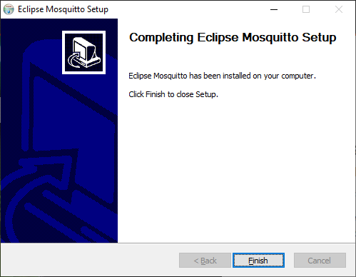
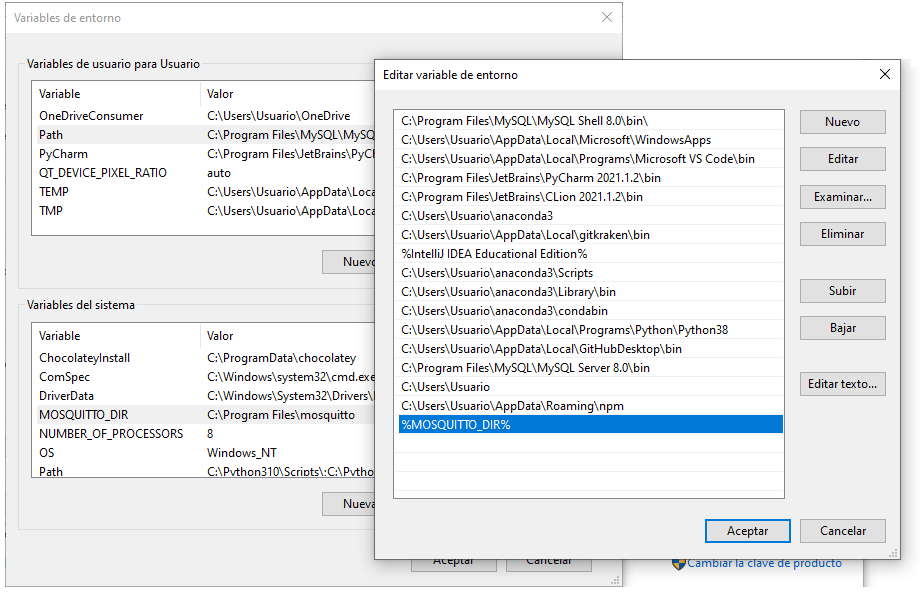
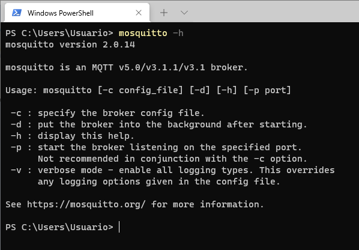
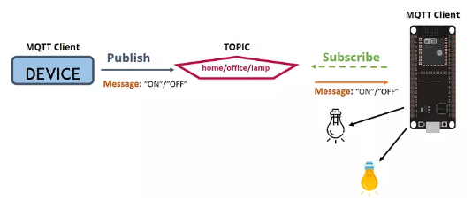
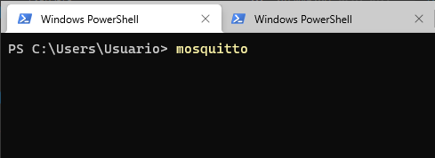
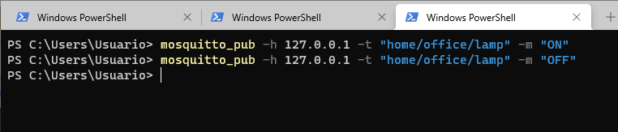

# Reunión de trabajo 2

> **Objetivos**
> * Poner a funcionar el mosquitto y realizar una prueba sencilla
> * Integrar mqtt con blockchain


## Actividades

### 1. Poniendo a funcionar el mosquitto

Lo primero que se tiene que hacer es la instalación, para ello se descarga la herramienta, de acuerdo al sistema operativo del siguiente [link](https://mosquitto.org/download/). En nuestro caso como la maquina es con windows por ahora la prueba la vamos a realizar con esta.

Tambien se recomienda mirar luego como llevar la cabo la implementación en docker. Los siguientes enlaces pueden ser utiles:
1. [**Repo: mosquitto-docker-compose**](https://github.com/vvatelot/mosquitto-docker-compose)
2. [**Repo: docker-recorder**](https://github.com/owntracks/docker-recorder)
3. [**Docker hub: eclipse-mosquitto**](https://hub.docker.com/_/eclipse-mosquitto)
4. [**Repo: tutorials.IoT-over-MQTT de FIWARE**](https://github.com/FIWARE/tutorials.IoT-over-MQTT)
5. https://medium.com/himinds/mqtt-broker-with-secure-tls-and-docker-compose-708a6f483c92
6. https://medium.com/swlh/using-docker-compose-to-build-zigbee-infrastructure-336983a6ad67
7. https://sensorsiot.github.io/IOTstack/Containers/Mosquitto/
8. https://docs.foundries.io/73/tutorials/mosquitto.html
9. https://programozdazotthonod.hu/cookbook/installing-mosquitto/

#### Instalación

La instalación se hizo sin ningun problema.



La ruta de instalación quedo para el caso en: 

```
C:\Program Files\mosquitto
```

Luego de instalar se agrega esta ruta al path para poder correr desde consola los comandos de mosquitto.



Finalmente se prueba la correcta instalación del mosquitto mediante el comando:

```
mosquitto -h
```

Si todo sale bien, la salida será así:




#### Pruebas iniciales

Para esta prueba se tomo como base estre gráfico:




* **Topicos**: ```home/office/lamp```
* **Messages**: 
  * ```ON```
  * ```OFF```

Los comandos de prueba fueron:

* **Suscriber**:

  * **Registro del suscriber**:
  
  ```
  mosquitto_sub -h 127.0.0.1 -t "home/office/lamp"
  ```

* **Publisher**:
  * **Prendida de la lampara**: 
  
  ```
  mosquitto_pub -h 127.0.0.1 -t "home/office/lamp" -m "ON"
  ```

  * **Apagada de la lampara**:

  ```
  mosquitto_pub -h 127.0.0.1 -t "home/office/lamp" -m "OFF"
  ```

Veamos si dan las pruebas:

1. Arrancar el mosquitto:
   
   ```
   mosquitto
   ```

   Resultado en pantalla:

   

2. Registrar el subscriber:
   
    ```
    mosquitto_sub -h 127.0.0.1 -t "home/office/lamp"
    ```

    Resultado en pantalla:

    

3. Enviar los comandos del publisher:
   

   ```
   mosquitto_pub -h 127.0.0.1 -t "home/office/lamp" -m "ON"
   ```
   
   ```
   mosquitto_pub -h 127.0.0.1 -t "home/office/lamp" -m "OFF"
   ```

   Resultado en pantalla:

   

### Instalación de paho

Se usaron los siguientes comandos en anaconda ([link](https://anaconda.org/conda-forge/paho-mqtt)):

```
conda install -c conda-forge paho-mqtt
conda install -c conda-forge/label/cf202003 paho-mqtt
```


- [ ] Poner a funcionar el mosquitto.
- [ ] Hacer una prueba sencilla con el mosquitto.


## Enlaces

* https://mpolinowski.github.io/devnotes/2021-06-02--mqtt-cheat-sheet
* https://www.win.tue.nl/~lrahman/iot_2016/tutorial/MQTT_2016.pdf
* https://deltacontrols.com/wp-content/uploads/MQTT-API-Reference-Guide-1-1.pdf
* https://www.thingrex.com/mqtt_cheat_sheet/
* https://www.thingrex.com/categories/