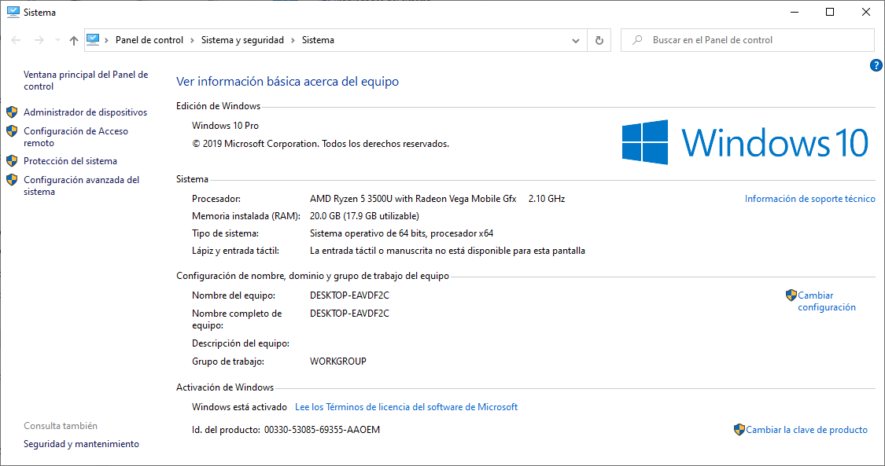

## Instalar Hyperledger

### Objetivos 

- [ ] Instalar una blockchain privada.
- [ ] Documentar brevemente el procedimiento.
- [ ] Hacer una prueba sencilla donde se muestre el correcto funcionamiento

### Documentación breve del procedimiento de instalación

La instalación de hyperledger, descrita en este apartado, se realizo en una maquina con las siguientes caracteristicas:



La instalación se llevo a cabo siguiendo los enlaces propuestos al final del documento, sin embargo, de estos el mas importante es el suministrado en la documentación oficial de hyperledger en: [Hyperledger Fabric - Getting Started](https://hyperledger-fabric.readthedocs.io/en/release-1.4/getting_started.html).

**Prerequisitos**

Los prerequisitos de instalación se describen en el siguiente [enlace](https://hyperledger-fabric.readthedocs.io/en/release-1.4/prereqs.html). De modo que la tarea inicial es llevar a cabo la instalación de todos estos. En una maquina linux es mas simple, en una maquina Windows hay que hace mas marañanas. En todo caso, suponiendo que se realizo la instalación con exito de todos los prerequisitos es bueno verificar que estos funcionen correctamente. A continuación se muestra de manera resumida los comandos empleados para esto:


|Prerequisito|Comando|
|---|---|
|curl|```curl --version```|
|Docker|```docker --version```|
|Docker Compose |```docker-compose --version```|
|Golang |```go version```|
|Nodejs |```node -v```|
|NPM |```npm -v```|

Tener en cuenta las recomentaciones sobre python que se dan en la documentación.

En la sección de **Windows extras** se describen unos pasos necesarios antes de clonar con git. Tal y como se dice aqui, la recomendación es usar el git bash de modo que si no lo tiene instalado ([link](https://gitforwindows.org/)) en su maquina windows instalelo y procesa a ejecutar allí todos los comandos git que se muestran a continuación:

```
# Before running any git clone commands
git config --global core.autocrlf false
git config --global core.longpaths true

# check the settings of anteriores commands
git config --get core.autocrlf
git config --get core.longpaths
``` 

**Proceso de instalación**


## Enlaces
* https://www.codementor.io/@arvindmaurya/hyperledger-fabric-on-windows-1hjjorw68p
* https://medium.com/@harismumtaz_19503/step-by-step-hyperledger-fabric-installation-on-windows-10-7ad462cea89c
* https://hyperledger-fabric.readthedocs.io/en/release-1.4/getting_started.html
  
<!---
Prerequisites (https://hyperledger-fabric.readthedocs.io/en/release-1.4/prereqs.html)
cURL — latest version (ok)
Docker — version 17.06.2-ce or greater (ok)
Docker Compose — version 1.14.0 or greater (ok)
Golang — version 1.11.x (ok)
Nodejs — version 8.x (other versions are not in support yet) (ok)
NPM — version 5.x (ok)
Python 2.7

curl:

docker:
PS C:\Users\Usuario> docker --version
Docker version 20.10.12, build e91ed57
PS C:\Users\Usuario> docker-compose --version
Docker Compose version v2.2.3
PS C:\Users\Usuario>


PS C:\Users\Usuario> npm -v
8.1.0
PS C:\Users\Usuario> node -v
v16.13.0
PS C:\Users\Usuario>

python 2.7:
https://www.python.org/downloads/release/python-2718/

https://www.python.org/downloads/windows/?ref=hackernoon.com

otros (admon):
npm install --global windows-build-tools
npm install --global grpc

git con windows:

Before running any git clone commands, run the following commands:

git config --global core.autocrlf false
git config --global core.longpaths true
You can check the setting of these parameters with the following commands:

git config --get core.autocrlf
git config --get core.longpaths


-----------------------------------------------------------------------------------

Instalando hyperledger-fabric (https://hyperledger-fabric.readthedocs.io/en/release-2.2/install.html) 

1. If needed, clone the hyperledger/fabric-samples repository (https://github.com/hyperledger/fabric-samples)

Before running any git clone commands, run the following commands:

git config --global core.autocrlf false
git config --global core.longpaths true
You can check the setting of these parameters with the following commands:

git config --get core.autocrlf
git config --get core.longpaths

[
PS C:\Users\Usuario> git config --global core.autocrlf false
PS C:\Users\Usuario> git config --global core.longpaths true
PS C:\Users\Usuario> git config --get core.autocrlf
false
PS C:\Users\Usuario> git config --get core.longpaths
true
PS C:\Users\Usuario>


]


git config --global init.defaultBranch master (https://stackoverflow.com/questions/64349920/git-error-fatal-invalid-branch-name-init-defaultbranch)

git clone https://github.com/hyperledger/fabric-samples.git 

2. Checkout the appropriate version tag

Install the Hyperledger Fabric platform-specific binaries and config files for the version specified into the /bin and /config directories of fabric-samples


** Once you are ready, and in the directory into which you will install the Fabric Samples and binaries, go ahead and execute the command to pull down the binaries and images.

Esto toco con el curl de wsl, el de windows no dio.
El wsl es muy viejo asi que tampoco pasa de la parte relacionada con la invocacion de docker.


Se volvio a realizar desde la terminal del git de windows.

curl -sSL https://bit.ly/2ysbOFE | bash -s

Ahora si parece que esta mejor la salida.


[Aca vamos..........................................................................]


https://hyperledger-fabric.readthedocs.io/en/release-2.2/install.html# 

You may want to add that to your PATH environment variable so that these can be picked up without fully qualifying the path to each binary. e.g.:

export PATH=<path to download location>/bin:$PATH

Continuara...

https://hyperledger-fabric.readthedocs.io/en/release-2.2/test_network.html


Proceso

https://www.hyperledger.org/

Creating Your Own Blockchain Network

Setting up a local Hyperledger Fabric/Composer development environment

https://medium.com/kago/tutorial-to-install-hyperledger-composer-on-windows-88d973094b5c
https://www.codementor.io/@arvindmaurya/hyperledger-fabric-on-windows-1hjjorw68p
https://medium.com/@harismumtaz_19503/step-by-step-hyperledger-fabric-installation-on-windows-10-7ad462cea89c
https://hyperledger-fabric.readthedocs.io/en/release-1.4/prereqs.html
https://hyperledger-fabric.readthedocs.io/en/release-2.2/install.html
https://hackernoon.com/hyperledger-fabric-installation-guide-74065855eca9

--->